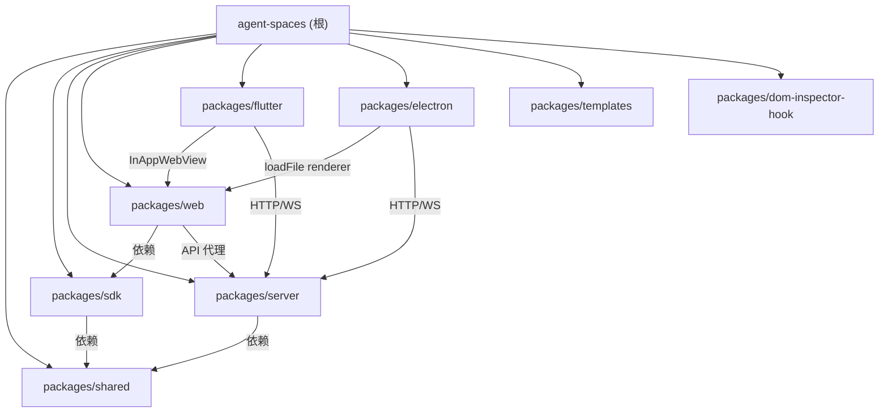

# Agent Spaces

Agent Spaces 是一个**本地多 Agent 协同编程平台**。基于 pnpm monorepo 组织 8 个包：`shared`（前后端共享类型）、`sdk`（前端 API 调用层）、`server`（Express 5 后端 + WebSocket + Agent 编排引擎）、`web`（Next.js 16 前端 SPA）、`flutter`（多平台原生壳应用）、`electron`（桌面平台壳应用）、`templates`（Agent / Chat / MCP / Skill / Plugin / Workflow 模板库）、`dom-inspector-hook`（浏览器端 DOM 源码定位 Hook）。

核心能力：6 种 Agent 运行时（Claude Code / Codex / Open Agent SDK / LangChain / Hermes / Oh-My-Pi）、Workflow DAG 可视化编辑器（含 command 节点 + UI 渲染节点）、Mini-app 沙箱子系统（React/HTML 项目 + 沙箱服务编译 + Agent 运行时 + 客户端 RPC + SQLite）、Monaco 编辑器 + TypeScript LSP、频道聊天（含 Chat 独立页）、xterm 终端、Git 操作与 Worktree 并行开发、Issue 自动化、Kanban 看板、文档数据库（Notion 风格 + 向量搜索）、通知中心（飞书 / 企微 / Native）、Plugin 插件系统、Hook 引擎、订阅管理、Skill 系统。

数据持久化采用 JSON 文件 + SQLite（位于 `~/.agent-spaces-data/`），WebSocket 事件命名 `domain.action`，REST API 按资源分组并以 Bearer Token 鉴权。

## 约定的规则

- TypeScript strict + ESNext；后端 ESM（`.js` 后缀），前端 Next.js App Router + `"use client"`
- 状态管理：Zustand（web）/ Riverpod（flutter）；UI 基于 shadcn/ui + TailwindCSS 4
- 前端 API 调用统一经 `@agent-spaces/sdk`；REST 路由按资源分组，JSON body 上限 50MB，zod 校验
- 状态字段用联合字面量（非 `enum`），时间戳 ISO 字符串（Workflow 子树 Unix 毫秒）
- WS 事件 `domain.action`，WS 鉴权经 `token` 查询参数；i18n next-intl（34 命名空间 x 中/英）
- 文件名/目录名 kebab-case；本项目使用 `codegraph` MCP 提供 AST 级代码知识图谱，优先于 grep/read
- 详见 [claude/conventions.md](claude/conventions.md)

## 文件索引

| 文件 | 说明 |
|------|------|
| [claude/overview.md](claude/overview.md) | 项目总览、核心定位、技术栈、数据流 |
| [claude/conventions.md](claude/conventions.md) | 编码约定、命名规范、数据持久化规则 |
| [claude/module-responsibilities.md](claude/module-responsibilities.md) | 各模块职责概述 |
| [claude/entrypoints.md](claude/entrypoints.md) | 入口文件、启动命令、环境变量 |
| [claude/public-interfaces.md](claude/public-interfaces.md) | REST API、WebSocket 事件、页面路由、SDK |
| [claude/dependencies-and-config.md](claude/dependencies-and-config.md) | 依赖关系图、关键依赖、构建顺序、配置文件 |
| [claude/data-model.md](claude/data-model.md) | 持久化架构、核心类型、状态枚举、Store 字段抽样 |
| [claude/testing-and-quality.md](claude/testing-and-quality.md) | 测试现状、验证命令、质量工具 |
| [claude/file-map.md](claude/file-map.md) | 文件地图、源码结构、文档目录 |
| [claude/faq.md](claude/faq.md) | 常见问题 |
| [claude/changelog.md](claude/changelog.md) | 变更记录（最近 5 条） |

## 模块索引



| 模块 | 路径 | 语言 | 源文件数 | 职责 |
|------|------|------|----------|------|
| shared | `packages/shared` | TypeScript | 29 | 前后端共享类型定义（27 个子模块 + 1 入口 + 1 类型聚合） |
| sdk | `packages/sdk` | TypeScript | 42 | 前端 API 统一 SDK（39 个模块适配器，250+ 方法） |
| server | `packages/server` | TypeScript | 185+ | Express 5 后端 + WebSocket + 6 运行时 Agent 编排 + Workflow 引擎 + Mini-app 子系统 |
| web | `packages/web` | TSX/TypeScript | 290+ | Next.js 16 前端 SPA（44 Store + 29 页面 + 37 lib + 200+ 组件） |
| flutter | `packages/flutter` | Dart | 46+2 | Flutter 多平台壳应用（WebView + SSH 终端 + 多协议文件源 + 2 测试） |
| electron | `packages/electron` | TypeScript | 7+ | Electron 桌面壳（窗口/local:// 协议/桌面原生能力/全局快捷键/renderer↔main 桥接） |
| templates | `packages/templates` | JSON/Markdown | 400+ | 模板库（184 Agent + 6 Chat + 9 MCP + 66+ Skill + 120+ Plugin + Workflow/Prompt/OutputStyle/Mini-app） |
| dom-inspector-hook | `packages/dom-inspector-hook` | TypeScript | 2 | 浏览器端 DOM 源码定位 Hook（HTTP 上报 / IDE 跳转） |

## 运行与开发

```bash
pnpm install          # 安装依赖（Node >= 20，pnpm >= 9）
pnpm dev              # 并行启动 server(3100) + web(3000)
pnpm build            # 构建（shared -> sdk -> server -> web -> copy）
pnpm build:docker     # Docker 构建（Dockerfile.server）
pnpm up               # docker compose up -d --build
pnpm lint             # 全包 lint（pnpm -r lint）
pnpm clean            # 清理 dist/.next/server web 产物
pnpm publish          # 构建 shared/server 并发布到 npm
```

详见 [claude/entrypoints.md](claude/entrypoints.md)。

## AI 使用指引

- `packages/web/AGENTS.md`、`packages/web/DESIGN.md` —— Next.js 16 注意事项、UI 设计规范（MiniMax 风格）
- `docs/` —— 45+ 项目文档，涵盖 Agent 运行时、Workflow、Mini-app、通知中心、Hook、LSP、Chat、Worktree 等
- `docs/superpowers/{plans,specs}/` —— 按日期归档的功能设计与实施计划
- `codegraph` MCP —— 基于 AST 的代码知识图谱，做结构性查询（定义/调用/影响面）时优先使用
- `fff` MCP —— 快速文件查找（frecency 排序）

## 扫描状态

- **更新时间**：2026-06-24 09:27:10
- **本次性质**：增量更新 + 断点续扫（自 2026-06-23）
- **已扫描范围**：全部 8 个模块；本次定点深挖 4 处缺口：server `storage/` 关键 store 字段（chat-store 全字段 / agent-store=SQLite usage / workflow-store 目录布局 / task/issue/workspace 扁平 CRUD 范式）、web `components/workflow/` hooks/utils 5 文件、templates agents 模板格式样本（含 engineering-code-reviewer 完整结构）、确认 electron/renderer/ 为 Monaco 离线 bundle
- **跳过范围**：node_modules、dist、.next、构建产物、二进制文件、`.agent-spaces-data`、`packages/electron/renderer/monaco/`（Monaco 离线 bundle，与业务无关）
- **覆盖率**：约 95%（从 94% 提升）
- **本次新增**：
  - `claude/data-model.md` 新增"Store 字段抽样"章节（chat-store ChatAgent/ChatMessage/ChatSession/WorkspaceTabState 全字段、agent-store 实为 SQLite usage 表结构 + 成本估算 fallback、workflow-store 目录式布局、workspace/issue/task store 扁平 CRUD 范式）
  - `packages/server/claude/storage.md` 修正 agent-store 误描述（实为 SQLite usage 而非 preset）、补充 chat-store/workspace-store/issue-store/task-store 字段要点
  - `packages/web/claude/component-groups.md` 新增"workflow/ 86 文件分组（2026-06-24 补全）"章节（按 hook/utils/types/节点视图/对话框/属性面板/画布七组展开）
  - 全部 .md 文件确保 UTF-8 编码（修复此前 GBK 读写异常）
- **仍存缺口**：
  - server `storage/` 其余 JSON store（command/code-favorites/worktree/robot-account/subscription/hook/llm/speech/user-settings/npm-settings）字段未逐一抽取（多为 100–300 行扁平 CRUD，按需 Read 即可）
  - templates agents 184 模板的具体 system prompt 内容未逐一抽样（已确认格式：YAML frontmatter + 7 段标准章节）
  - templates plugins 120+ 文件中各插件的 tools.js/workflow.js 实现细节未深抽
  - web `components/workflow/` 部分 .tsx 对话框/属性面板内部结构未逐一深抽
  - `packages/electron/renderer/` 为 web 构建产物复制物 + Monaco 离线 bundle，继续跳过
