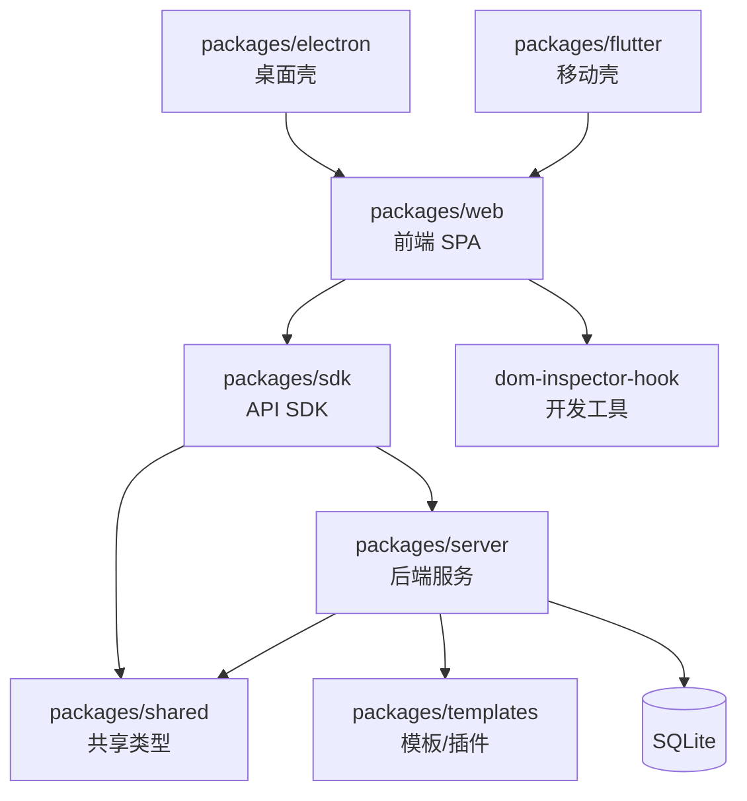

# Agent Spaces

多智能体协作编程平台。支持 AI Agent 创建/编排/执行/可视化，Workflow 可视化编辑，代码编辑器 + Git + 知识库管理。pnpm monorepo，Web (Next.js 16) + Server (Express 5) + Electron + Flutter。

核心能力：多 AI 运行时适配（Claude Code/Codex/LangChain 等）、可视化 Workflow 执行引擎、WebSocket 实时通信、SQLite 存储。

## 约定

- 包管理用 pnpm workspace，包间依赖 `workspace:*`。
- 前端禁直接调后端 API，必须走 `@agent-spaces/sdk`。
- ESM 优先，TypeScript strict。
- `AGENT_SPACES_DATA_DIR` 默认 `~/.agent-spaces-data`，运行时数据勿改。
- 详情放 `claude/*.md`，CLAUDE.md 只做索引。

## 文件索引

| 文件 | 用途 | 何时阅读 |
|---|---|---|
| [架构总览](claude/overview.md) | 架构边界、运行时形态、设计取舍 | 首次接触项目 |
| [开发约定](claude/conventions.md) | 命令、技术栈、代码风格、禁止事项 | 开始开发前 |
| [模块职责](claude/module-responsibilities.md) | 各模块核心能力 | 需了解某个模块 |
| [入口与启动](claude/entrypoints.md) | 入口文件、构建流程 | 需要构建/启动项目 |
| [对外接口](claude/public-interfaces.md) | 页面路由、REST API、WebSocket、SDK | 需要调用/新增接口 |
| [依赖与配置](claude/dependencies-and-config.md) | 关键依赖、配置文件、环境变量 | 排查依赖/配置问题 |
| [数据模型](claude/data-model.md) | 存储、状态管理、类型定义 | 需要改数据结构 |
| [测试与质量](claude/testing-and-quality.md) | 测试命令、覆盖情况 | 需要运行/补充测试 |
| [文件索引](claude/file-map.md) | 目录结构、关键文件 | 需要定位文件 |
| [FAQ](claude/faq.md) | 常见问题 | 遇到常见问题时 |
| [变更记录](claude/changelog.md) | 索引更新记录 | 了解扫描历史 |

## 模块索引

| 模块 | 路径 | 职责 |
|---|---|---|
| Web | [packages/web](packages/web/CLAUDE.md) | Next.js 16 前端 SPA |
| Server | [packages/server](packages/server/CLAUDE.md) | Express 5 后端 + AI Agent 运行时 |
| Electron | [packages/electron](packages/electron/CLAUDE.md) | 桌面壳（窗口/协议/快捷键） |
| SDK | [packages/sdk](packages/sdk/CLAUDE.md) | 前端统一 API 层 |
| Shared | [packages/shared](packages/shared/CLAUDE.md) | 跨前后端类型定义 |
| Templates | [packages/templates](packages/templates/CLAUDE.md) | 模板/插件/技能打包 |
| DOM Inspector | [packages/dom-inspector-hook](packages/dom-inspector-hook/CLAUDE.md) | 开发工具 Hook |
| Flutter | [packages/flutter](packages/flutter/CLAUDE.md) | 移动端 WebView 壳 |
| Documents | [documents](documents/CLAUDE.md) | Docusaurus 文档站 |

## 扫描状态

- **更新时间**: 2026-07-06
- **已扫描**: 根目录结构、所有 package.json、主要入口文件、路由/服务/存储/API 层、最近 5 个迭代（runtime 管理 / issue 系统 / notification-hub / usage dashboard / mini-apps）
- **已覆盖模块**: 9/9（web, server, electron, sdk, shared, templates, dom-inspector-hook, flutter, documents）
- **跳过**: node_modules, .next, dist, out, release, agent-spaces-data 运行时数据, build 缓存
- **下一步建议**: 深挖 `packages/server/src/services/notification-hub/`（微信/飞书 Bot 协议）、`packages/templates/plugins/obsidian`（新插件）
