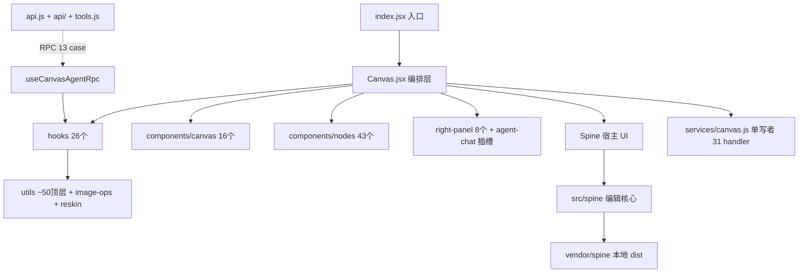

# 游戏资产生成画布 (game-asset-canvas)

Agent Spaces 宿主里的 React mini-app，用 ReactFlow 搭一个节点化的游戏资产生成画布：38 种节点调工作流（文生图/编辑/抠图/放大/语音/视频/深度图/任意工作流）或跑本地图像算法，外加浏览器端编辑器（Painterro/Pixelorama/Photopea/蒙版/Spine 骨骼/3D 导演台）与分镜创作子域；节点间连线传图片/视频/音频/文本产物，支持多工作区隔离 + 复制粘贴/属性粘贴 + 分组多实例执行 + 执行队列 + 画布版本 + Agent RPC 操控画布。

项目**无 package.json、无构建步骤**，所有运行时依赖经宿主 allowlist（`@xyflow/react` / `@dagrejs/dagre` / `@agent-spaces/ui`）或本地 vendor / CDN 加载。源码三层结构：Canvas.jsx 只做编排，业务逻辑在 hooks（26 个），纯函数/单例在 utils，展示子组件在 components/canvas；编辑器子域独立目录（`src/spine/`、`ui-splitter/`、`utils/reskin/`）。

> **本文件是轻量索引**，细节在 `claude/*.md`；逐轮改动与最新坑点查 `src/handoff.md`（活文档，优先级更高）。

## 优先约定（务必遵守）

- **改动生效**：`src/**` 刷新即生效；`src/services/*.js` chokidar 热重载；宿主层（`packages/web/*` / `packages/server/*`）**必须重启 web**。
- **ReactFlow**：不要在 `decoratedNodes` 覆盖 `selected`；建节点必须同时给顶层 `width/height` + `style:{width,height}`；节点内容区加 `nodrag nopan nowheel`；边颜色/标签是展示态不写持久化。
- **数据派生**：透传节点（imageDisplay/videoDisplay）转发本轮派生输入（含空数组）；videoEditor 上游视频去重合并；输出协议 `images: string[]` + 可选 `resources[]`（thumb/groupName/label）；列表 key 用 occurrenceKeys。
- **工作流**：必须 `max_wait_ms:600000`；提交前 `normalizeImageUrls`；产出 `persistImagesToBackend` 落地（工作区 directory 时单写落本地）；媒体节点走 onGenerateMedia + returnRawEndOutput。
- **持久化**：写入走 `services/canvas.js` 单写者；多工作区数据存 `configs/workspaces/<id>/`，settings/提示词库/面板布局/节点预设全局共享；config 初读三重读取。
- **执行**：生成记录双路径都写 history；队列中断立即清节点状态并丢弃晚到结果；分组多实例按冻结的 executionTarget 写回。
- **依赖**：从 `@agent-spaces/ui` 命名导入图标（不要直接 `lucide-react`）；不要 `URL.createObjectURL` 存图（用 `uploadFile`）。

更多见 [开发约定](claude/conventions.md)。

## 文件索引

| 文件 | 用途 | 何时阅读 |
|------|------|---------|
| [架构总览](claude/overview.md) | 在宿主中的位置、源码结构、核心数据流、关键设计取舍 | 首次了解项目时 |
| [开发约定](claude/conventions.md) | 改动生效规则、ReactFlow/数据派生/执行/Agent RPC/UI-CSS 约定、安全边界 | 改代码前必读 |
| [模块职责](claude/module-responsibilities.md) | 38 种节点类型、26 个 hooks、utils 四组、components、services、spine 子域 | 找某模块在哪实现 |
| [入口与启动](claude/entrypoints.md) | manifest 注册、Canvas 启动流程、工作区切换重载、Chat 插槽、RPC 启动 | 调启动问题/理解初始化 |
| [对外接口](claude/public-interfaces.md) | Agent 画布 API（~27 handler）、RPC 13 case、服务端 31 handler、宿主 API、插件工具、工作流契约 | 改 Agent 能力/service handler 时 |
| [依赖与配置](claude/dependencies-and-config.md) | 宿主暴露的库、vendor/CDN 库、configs/ 数据布局、settings 全字段、工作区 directory | 加新依赖/改配置时 |
| [数据模型](claude/data-model.md) | Node/Edge/Group/HistoryItem/版本快照/LastParams/预设/Settings/Workspaces 结构 | 改持久化数据时 |
| [测试与质量](claude/testing-and-quality.md) | node:test 运行方式、语法自检脚本、质量风险表、调试技巧 | 验收/排查问题时 |
| [文件索引](claude/file-map.md) | 目录树（297 个 JS/JSX）+ 关键路径速查 | 找文件位置 |
| [FAQ](claude/faq.md) | 改动不生效/删除键失效/派生残留/key 重复/RPC 超时/执行写错 run 等常见问题 | 遇到坑先查这里 |
| [更新记录](claude/changelog.md) | init-project 索引生成/更新记录（最近 5 条） | 看本索引何时更新过 |

## 模块索引（项目内的子域）

- **components/**（顶层 ~45 + canvas 16 + nodes 43 + right-panel 8 + ui-splitter 10）：UI 展示与对话框
- **hooks/**（26）：业务逻辑，自带 state/effect
- **utils/**（~50 顶层 + 11 image-ops + 9 reskin）：纯函数/常量/单例
- **services/**（1）+ **api/ api.js tools.js**：服务端单写者 + Agent 对外接口
- **spine/**：Spine 编辑核心（非 React），宿主 UI 在 components/Spine*

## 扫描状态

- **更新时间**：2026-08-28
- **已扫描**：src 全部源码结构（297 个 JS/JSX，不含 vendor；含 ~62 个 node:test）；定点核对 6 个权威源（constants/settings/api/services/manifest/handoff）
- **跳过**：vendor/（二进制）、assets/、chat/、data/、configs/ 内容值、根目录历史交接文档
- **覆盖率**：目录结构与常量/接口 100%；组件内部实现按 handoff.md 提炼，未逐文件细读
- **建议下一步深挖**：
  - 精确节点组件实现：定点读 `components/nodes/<具体>.jsx`
  - 精确算法实现：`utils/image-ops/`、`utils/reskin/`
  - 改宿主层：`packages/web/src/components/mini-apps/react-renderer.tsx` + `ui-exports.ts` + `use-mini-app-host-api.tsx`

## 产出状态更新约定（2026-08-28）

- 节点/分组业务数据写入统一调用 `useCanvasState.updateCanvasData({ source, targetType, targetId, key, value, method })`；入口按目标 id 和 key 做局部更新并输出唯一 `[CanvasStateUpdate]` 调试日志。
- `updateNodeData(nodeId, patch)` 仅是兼容包装，函数 patch 表示基于当前 data 生成局部 patch，不得作为完整 data 替换。
- `useGroupExecution.commit` 不得直接 `setNodes/setGroups` 全量映射；执行实例提交必须携带 `source: 'group-execution'` 并精确更新目标分组/节点。
- ImageResult 的分组/历史切换只改变展示态；删除历史图片只更新指定版本，不能把过滤后的展示数组写回其他版本或分组。
