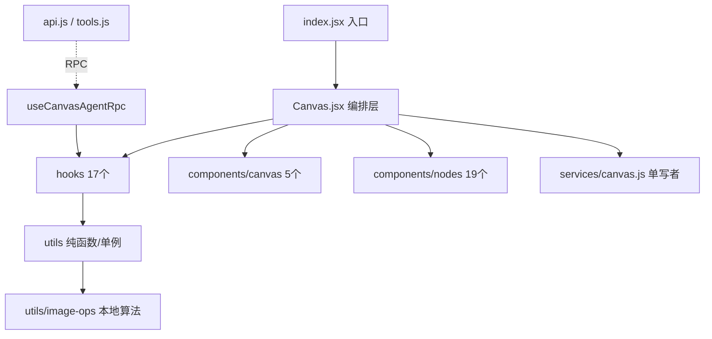

# 游戏资产生成画布 (game-asset-canvas)

Agent Spaces 宿主里的 React mini-app，用 ReactFlow 搭一个节点化的游戏资产生成画布：节点调工作流（文生图/编辑/抠图/放大/语音/视频）或跑本地图像算法（GIF/像素化/Sheet 合成），节点间连线传图，支持多工作区隔离 + 复制粘贴 + 分组 overlay/多实例执行 + Agent RPC 操控画布。

项目**无 package.json、无构建步骤**，所有运行时依赖经宿主 allowlist（`@xyflow/react` / `@dagrejs/dagre` / `@agent-spaces/ui`）或本地 vendor / CDN 加载（fabric/painterro/pixelorama/gifenc/browser-image-compression）。源码三层结构：Canvas.jsx 只做编排，业务逻辑在 hooks，纯函数/单例在 utils，展示子组件在 components/canvas。

> **本文件是轻量索引**，细节在 `claude/*.md`。旧版单文件契约已废弃（仍保留作历史参考），新内容请写到 `claude/` 详情文件。

## 优先约定（务必遵守）

- **改动生效**：`src/**` 刷新即生效；`src/services/*.js` chokidar 热重载；宿主层（`packages/web/*` / `packages/server/*`）**必须重启 web**。
- **ReactFlow**：不要在 `decoratedNodes` 覆盖 `selected`；建节点必须同时给顶层 `width/height` + `style:{width,height}`；节点内容区加 `nodrag nopan nowheel`；`deleteKeyCode={['Backspace','Delete']}`。
- **工作流**：必须 `max_wait_ms:600000`（默认 120s jimeng/可灵超时）；外链图提交前 `normalizeImageUrls`；产出图 `persistImagesToBackend` 下载到 data/。
- **持久化**：写入走 `services/canvas.js` 单写者（不绕过）；多工作区数据存 `configs/workspaces/<id>/`，设置/提示词库/面板布局全局共享。
- **本地算法**：`(ImageData, params) => ImageData` 统一签名；云端处理器（enhance/compress/cutout.workflow）用 `__url` 透传跳过 ImageData 管道；批量并发用 `Promise.allSettled`。
- **依赖**：从 `@agent-spaces/ui` 命名导入图标（不要直接 `lucide-react`）；不要 `URL.createObjectURL` 存图（用 `uploadFile`）。
- **TDZ 规避**：被依赖的 const/useCallback 必须先声明（如 `REMBG_MODELS` 在 `CUTOUT_PARAMS` 前）。

更多见 [开发约定](claude/conventions.md)。

## 文件索引

| 文件 | 用途 | 何时阅读 |
|------|------|---------|
| [架构总览](claude/overview.md) | 在宿主中的位置、三层源码结构、核心数据流、关键设计取舍 | 首次了解项目时 |
| [开发约定](claude/conventions.md) | 改动生效规则、ReactFlow/状态/工作流/图片处理/Agent RPC 约定、命名风格、安全边界 | 改代码前必读 |
| [模块职责](claude/module-responsibilities.md) | 节点类型清单、17 个 hooks、utils、components、services、api/tools 职责 | 找某模块在哪实现 |
| [入口与启动](claude/entrypoints.md) | manifest 注册、index.jsx、Canvas 启动流程、工作区切换重载、服务端单写者加载 | 调启动问题/理解初始化 |
| [对外接口](claude/public-interfaces.md) | Agent 画布 API（10 handler）、服务端单写者 handlers、宿主 API、工作流契约 | 改 Agent 能力/service handler 时 |
| [依赖与配置](claude/dependencies-and-config.md) | 宿主暴露的库、vendor 本地库、CDN 库、configs/ 数据布局、环境差异 | 加新依赖/改配置时 |
| [数据模型](claude/data-model.md) | Node/Edge/Group/HistoryItem/Settings/Workspaces/PromptItem/AssetLibrary 结构 | 改持久化数据时 |
| [测试与质量](claude/testing-and-quality.md) | 语法自检脚本、质量风险表、lint/类型检查、调试技巧 | 验收/排查问题时 |
| [文件索引](claude/file-map.md) | 完整目录树（101 个 JS/JSX）+ 关键路径速查 | 找文件位置 |
| [FAQ](claude/faq.md) | 改动不生效/删除键失效/工作流超时/图片丢失/错位等常见问题定位 | 遇到坑先查这里 |
| [更新记录](claude/changelog.md) | init-project 索引生成/更新记录（最近 5 条） | 看本索引何时更新过 |

## 模块索引（项目内的子域）

- **components/**（顶层 17 + canvas 5 + nodes 19）：UI 展示
- **hooks/**（17）：业务逻辑，自带 state/effect
- **utils/**（16 顶层 + 11 image-ops）：纯函数/常量/单例
- **services/**（1）：服务端单写者
- **api.js / tools.js**：Agent 对外接口（RPC 到浏览器）

## 扫描状态

- **更新时间**：2026-07-25
- **已扫描**：`src/` 全部源码（101 个 JS/JSX），关键文件定点读取 13 个（Canvas/constants/services/api/workflow/image-ops/useCanvasState/useNodeExecutions/useCanvasAgentRpc/settings/storage/manifest/handoff）
- **跳过**：`vendor/`（51MB 二进制）、`assets/`（静态资源）、`chat/` `data/` `configs/`（运行时数据）、`src/handoff.md`（已提炼到详情）
- **覆盖率**：核心源码 100%，节点组件（19 个）和顶层 components（17 个）按文件名 + 关键代表性样本（NodeShell 不在本轮定点读取，但其约定已在 conventions/faq 提炼）
- **建议下一步深挖**：
  - 如需精确节点组件实现细节，定点读 `components/nodes/<具体>.jsx`
  - 如需精确 image-ops 算法实现，定点读 `utils/image-ops/<具体>.js`（gif.js / matte.js / pixelate.js 等）
  - 改宿主层时另读 `packages/web/src/components/mini-apps/react-renderer.tsx` + `ui-exports.ts` + `use-mini-app-host-api.tsx`
